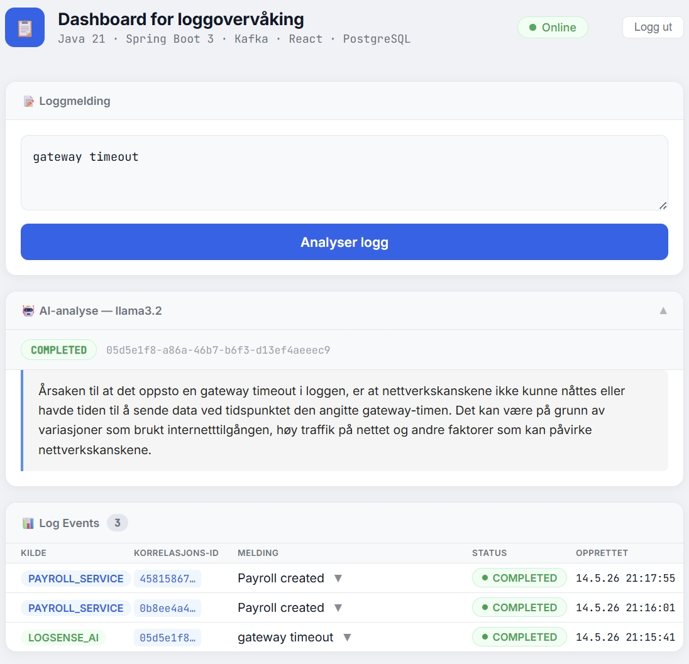

# AI Observability Platform

Lokal utviklingsplattform for LogSenseAI og Payroll-systemet, bygget med Kubernetes, Java, Spring Boot, Kafka, React, PostgreSQL, MySQL og Ollama LLM.

Plattformen gir et komplett miljø for:

* AI-basert observability
* hendelsesdrevet arkitektur
* realtime logganalyse
* Kafka-basert meldingsflyt
* distribuert backend-prosessering
* lokal Kubernetes-utvikling

---

## 🎥 Demo

### 🎬 AI Observability Platform - Klikk på bildet nedenfor for å se hele demoen på YouTube ▶️

[](https://www.youtube.com/watch?v=lvd7c52SFAo&list=PLOwWtF7kBLb9jhErLeylQOukc290gTNdD&index=1)
Disclaimer: Stemmen i videoen er generert med AI-basert tekst-til-tale-teknologi.

# Oversikt

Plattformen kjører flere tjenester lokalt i Kubernetes og kobler sammen:

* LogSenseAI Backend
* LogSenseAI Frontend
* Payroll Backend
* Payroll Frontend
* Kafka
* Zookeeper
* PostgreSQL
* MySQL
* Ollama (Llama3.2)

Systemet bruker Kafka som sentral meldingsbroker mellom tjenester og AI-analyse.

---

# Arkitektur

```text
Browser
        │
        ├── LogSenseAI Frontend (3000)
        │           │
        │           ▼
        │    LogSenseAI Backend (8080)
        │           │
        │           ├── Kafka
        │           ├── PostgreSQL
        │           └── Ollama LLM
        │
        └── Payroll Frontend (3001)
                    │
                    ▼
             Payroll Backend (8282)
                    │
                    ├── Kafka
                    ├── MySQL
                    └── LogSenseAI
```

---

# Teknologistabel

| Lag               | Teknologi               |
| ----------------- | ----------------------- |
| Backend           | Java 21 + Spring Boot 3 |
| Frontend          | React                   |
| Meldingssystem    | Apache Kafka            |
| Databaser         | PostgreSQL + MySQL      |
| AI                | Ollama (Llama3.2)       |
| Container Runtime | Docker Desktop          |
| Orkestrering      | Kubernetes              |
| API Dokumentasjon | Swagger / OpenAPI       |

---

# Prosjektstruktur

```text
D:\ai-observability-platform\
│
├── run-all.bat
├── restart-pods.bat
├── rebuild-logsense.bat
├── rebuild-payroll.bat
├── docker-compose.yml
│
└── k8s\
    ├── logsense-ai-backend.yaml
    ├── logsense-ai-frontend.yaml
    ├── payroll-backend.yaml
    ├── payroll-frontend.yaml
    ├── postgres.yaml
    ├── mysql.yaml
    ├── kafka.yaml
    ├── zookeeper.yaml
    ├── ollama.yaml
    ├── ollama-deployment.yaml
    └── ollama-service.yaml

D:\javaworkspace\
│
├── logsense-ai-backend\         # Java Spring Boot backend
│   ├── Dockerfile
│   └── .env
│
└── payroll-backend\             # Java Spring Boot backend
    ├── Dockerfile
    └── .env

D:\reactproject\
│
├── logsense-ai-frontend\        # React frontend
│   └── Dockerfile
│
└── payroll-frontend\            # React frontend
    └── Dockerfile
```

---

# Kubernetes Komponenter

| Komponent            | Beskrivelse         |
| -------------------- |---------------------|
| logsense-ai-backend  | LogsenseAI API      |
| logsense-ai-frontend | LogsenseAI UI       |
| payroll-backend      | Payroll API         |
| payroll-frontend     | Payroll UI          |
| kafka                | Event broker        |
| zookeeper            | Kafka koordinering  |
| postgres             | LogSenseAI database |
| mysql                | Payroll database    |
| ollama               | Lokal LLM service   |

---

# Tjenester og porter

| Tjeneste            | URL                                              |
| ------------------- | ------------------------------------------------ |
| LogSenseAI Frontend | [http://localhost:3000](http://localhost:3000)   |
| LogSenseAI Backend  | [http://localhost:8080](http://localhost:8080)   |
| Payroll Frontend    | [http://localhost:3001](http://localhost:3001)   |
| Payroll Backend     | [http://localhost:8282](http://localhost:8282)   |
| Ollama API          | [http://localhost:11434](http://localhost:11434) |

---

# Kubernetes Services

| Service          | Port  |
| ---------------- | ----- |
| kafka-service    | 9092  |
| postgres-service | 5432  |
| mysql-service    | 3306  |
| ollama           | 11434 |

---

# Intern kommunikasjon

| System     | Adresse                 |
| ---------- | ----------------------- |
| Kafka      | `kafka-service:9092`    |
| PostgreSQL | `postgres-service:5432` |
| MySQL      | `mysql-service:3306`    |
| Ollama     | `http://ollama:11434`   |

---

# Første gangs oppsett

## GitHub PAT for Maven

Opprett:

```text
C:\Users\<brukernavn>\.m2\settings.xml
```

```xml
<?xml version="1.0" encoding="UTF-8"?>
<settings>
  <servers>
    <server>
      <id>github</id>
      <username>DIN_GITHUB_BRUKER</username>
      <password>DIN_GITHUB_PAT</password>
    </server>
  </servers>
</settings>
```

---

# Miljøvariabler

## LogSenseAI

Fil:

```text
D:\javaworkspace\logsense-ai-backend\.env
```

```env
DB_PASSWORD=dittpassord
JWT_SECRET=dinJwtHemmelighet
GOOGLE_CLIENT_ID=dinClientId
GOOGLE_CLIENT_SECRET=dinClientSecret
```

---

## Payroll Backend

Fil:

```text
D:\javaworkspace\payroll-backend\.env
```

```env 
DB_USERNAME=${DB_USERNAME}
DB_PASSWORD=${DB_PASSWORD}
```

Aktiver profil i IntelliJ:

```
Run Configuration → Environment variables → SPRING_PROFILES_ACTIVE=local
```

> `application-local.yml` skal ikke committes til Git (ligger i `.gitignore`)

---

# Oppstart

## Start hele plattformen

```bat
run-all.bat
```

Scriptet:

* starter Kafka + Zookeeper
* deployer Kubernetes resources
* starter databaser
* deployer LogSenseAI
* deployer Payroll-systemet
* deployer Ollama
* laster ned llama3.2 hvis den mangler
* oppretter port-forwarding

---

# Daglig bruk

| Situasjon          | Kommando                                    |
| ------------------ | ------------------------------------------- |
| Full oppstart      | `run-all.bat`                               |
| Restart alle pods  | `restart-pods.bat`                          |
| Rebuild LogSenseAI | `rebuild-logsense.bat`                      |
| Rebuild Payroll    | `rebuild-payroll.bat`                       |
| Restart deployment | `kubectl rollout restart deployment/<name>` |
| Vis pods           | `kubectl get pods`                          |
| Vis services       | `kubectl get svc`                           |
| Vis logs           | `kubectl logs -f deployment/<name>`         |

---

# Kubernetes Kommandoer

## Pods

```bash
kubectl get pods
```

## Services

```bash
kubectl get svc
```

## Logs

```bash
kubectl logs -f deployment/logsense-ai-backend
```

## Restart deployment

```bash
kubectl rollout restart deployment/logsense-ai-backend
```

## Deploy resources på nytt

```bash
kubectl apply -f k8s/
```

---

# Ollama Integrasjon

Ollama kjører som egen Kubernetes deployment.

## Deployment

```text
k8s/ollama-deployment.yaml
```

## Service

```text
k8s/ollama-service.yaml
```

## Backend konfigurasjon

```yaml
ollama:
  base-url: http://ollama:11434
  model: llama3.2
```

---

# Kafka Konfigurasjon

Alle backend-tjenester bruker:

```yaml
spring:
  kafka:
    bootstrap-servers: kafka-service:9092
```

---

# Database Konfigurasjon

## PostgreSQL

```yaml
spring:
  datasource:
    url: jdbc:postgresql://postgres-service:5432/logdb
```

## MySQL

```yaml
spring:
  datasource:
    url: jdbc:mysql://mysql-service:3306/payrolldb
```

---

# AI-basert observability

LogSenseAI analyserer automatisk:

* exceptions
* WARN events
* ERROR events
* Kafka-feil
* databasefeil
* runtime exceptions
* API-feil

Analyse utføres via:

```text
Ollama + Llama3.2
```

Resultater lagres i PostgreSQL og sendes realtime til frontend via WebSocket.

---

# Statuskontroll

```bash
kubectl get pods
kubectl get svc
```

Alle pods skal være:

```text
Running
```

---

# Veikart

* [x] Kubernetes deployment
* [x] Kafka-integrasjon
* [x] PostgreSQL + MySQL
* [x] Ollama AI-integrasjon
* [x] React frontend
* [x] AI-basert logganalyse
* [x] Realtime observability
* [ ] Metrics dashboard
* [ ] Dead Letter Queue
* [ ] Retry mekanisme
* [ ] CI/CD pipeline

---

# Om prosjektet

Prosjektet er utviklet som lærings- og observability-plattform innen:

* Kubernetes
* Apache Kafka
* Spring Boot
* distribuerte systemer
* AI-basert observability
* hendelsesdrevet arkitektur
* realtime logganalyse
* LLM-integrasjon med Ollama
* asynkron backend-prosessering